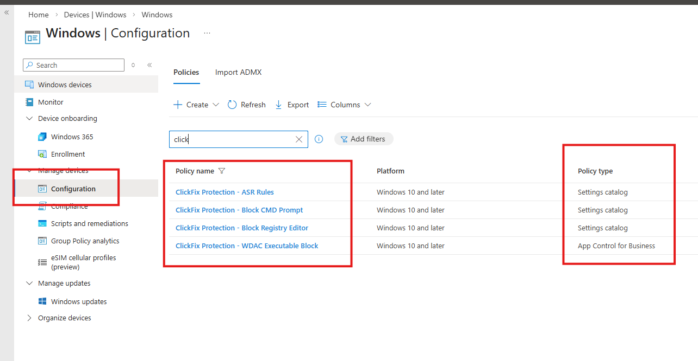

# ClickFix Intune Protection Helper

Deploys a layered set of Microsoft Intune policies to mitigate the **ClickFix social engineering attack** -- specifically the newer tradecraft where users are instructed to press **Win+X → I** to launch Windows Terminal (`wt.exe`) directly, bypassing traditional Run dialog detections.

## The Threat

ClickFix campaigns trick users into executing malicious commands by presenting fake "verification" prompts. The latest variant:

1. Instructs user to press **Win+X → I** (opens Windows Terminal as standard user)
2. User pastes attacker-supplied PowerShell/cmd commands
3. Commands execute in a legitimate-looking admin workflow environment

This bypasses the older **Win+R → paste → execute** detection because `wt.exe` is launched via the system power-user menu, not Explorer's Run dialog.

## Defense Architecture

This tool deploys **three policy layers** -- each addresses a different part of the attack surface:

```
┌─────────────────────────────────────────────────────────────────┐
│                    LAYER 1: Settings Catalog                    │
│  Blocks CMD prompt (+ batch files) and Registry Editor          │
│  Enforcement: User-scope ADMX policy via Intune                 │
│  Covers: Win+R → cmd, direct cmd.exe launch, .reg file import  │
├─────────────────────────────────────────────────────────────────┤
│                    LAYER 2: ASR Rules                           │
│  Defense-in-depth against script-based attacks                  │
│  • Block obfuscated scripts                                    │
│  • Block untrusted executables (prevalence/age)                │
│  • Block executable content from email/webmail                 │
│  • Block PSExec/WMI process creation                           │
├─────────────────────────────────────────────────────────────────┤
│              LAYER 3: App Control for Business (WDAC)            │
│  Native Intune Endpoint Security policy with XML upload         │
│  Kernel-level code integrity enforcement                       │
│  Blocks: powershell.exe, pwsh.exe, wt.exe, cmd.exe,           │
│          mshta.exe, cscript.exe, wscript.exe                   │
│  Works on: Pro, Enterprise, and Education editions             │
│  Scope: Device-level (admin exemption via group targeting)     │
│  Covers: ALL launch paths (Win+X, Run, Explorer, scheduled)   │
│  Portal: Endpoint Security > Application Control               │
└─────────────────────────────────────────────────────────────────┘
```

### Why WDAC over AppLocker?

**AppLocker only enforces on Windows Enterprise and Education.** On Windows Pro, AppLocker policies are accepted silently but **never enforced** -- Intune will show the profile as "Applied" while providing zero protection.

**WDAC (Windows Defender Application Control)** enforces on **Pro, Enterprise, and Education** editions (since Windows 10 1903). It operates at the kernel level as a code integrity policy, meaning:

- Blocks executables regardless of parent process (Win+X, Run, Explorer, scheduled tasks, etc.)
- Uses `OriginalFileName` from PE headers for tamper-resistant deny rules
- Cannot be bypassed by renaming executables

### Why not DisallowRun?

The **"Don't run specified Windows applications"** (`DisallowRun`) policy only intercepts processes spawned by `explorer.exe`. When a user opens Windows Terminal via Win+X → I, the process chain is:

```
ShellExperienceHost → wt.exe → powershell.exe
```

`explorer.exe` is not the parent, so `DisallowRun` **does not fire**.

### WDAC: Device-Scoped Policy

Unlike AppLocker, WDAC does not have per-user rules -- it applies to **all users on a device**. Admin exemption is handled by:

1. **Intune group targeting** -- Only assign the policy to standard user workstations
2. **Separate admin workstations** -- Use dedicated PAW (Privileged Access Workstations) for admin tasks
3. **Remote management** -- Admins use Azure Cloud Shell, remote PS sessions, or Intune for management
4. **Audit mode first** -- Deploy in audit mode (`"mode": "Audit"`) to validate impact before enforcing

## Prerequisites

| Requirement | Details |
|---|---|
| **PowerShell** | 7+ (PowerShell 5.1 is **not** supported) |
| **Module** | `Microsoft.Graph.Authentication` (auto-installed if missing) |
| **Role** | Global Administrator or Intune Administrator |
| **License** | Microsoft Intune (included in M365 E3/E5, Business Premium) |
| **Defender** | Microsoft Defender for Endpoint (for ASR rules) |
| **Windows** | Windows 10 1903+ or Windows 11 |

> **Important -- Device Enrollment:** Target devices **must be enrolled in Microsoft Intune** (MDM) for any of these policies to take effect. Intune enrolment is typically configured via Entra ID Join or Hybrid Join with auto-enrolment, or manually through **Settings → Accounts → Access work or school → Enroll only in device management**. Devices that are only Entra ID registered (BYOD / workplace join) without MDM enrolment will **not** receive Intune configuration policies.

## Graph API Permissions

When you run the deploy or rollback scripts, an interactive browser login prompt will appear asking you to consent to permissions for **Microsoft Graph PowerShell**. This is a **Microsoft-published, first-party enterprise application** (App ID `14d82eec-204b-4c2f-b7e8-296a70dab67e`) -- it is not a third-party or custom app registration. It is safe to consent.

The tool requests **least-privilege delegated scopes** -- only what is needed:

| Scope | Purpose |
|---|---|
| `DeviceManagementConfiguration.ReadWrite.All` | Create, assign, list, and delete Intune configuration policies (Settings Catalog, ASR, App Control for Business) |
| `Group.ReadWrite.All` | Create, find, and delete the Entra ID security group used for policy assignment (only exercised when `-CreateGroup` is used or `createGroup` is `true` in config) |

These are **delegated** permissions -- they run in the context of the signed-in user and are limited by that user's own Entra ID role (Global Admin or Intune Administrator). No application-level (daemon) permissions are used. If your organisation restricts user consent, a Global Admin can pre-consent for the tenant in **Entra ID → Enterprise applications → Microsoft Graph PowerShell → Permissions**.

## Quick Start

> **Requires PowerShell 7+.** These scripts do not support Windows PowerShell 5.1. Install PowerShell 7 from the [official docs](https://learn.microsoft.com/en-us/powershell/scripting/install/installing-powershell-on-windows) or run `winget install Microsoft.PowerShell`. Launch with `pwsh`.

> [!CAUTION]
> **The script deploys in audit mode by default.** This is intentional — WDAC and ASR policies can block legitimate applications and system tools. Validate the audit event logs on test devices before using `-Enforce` to switch to blocking mode.

```powershell
# 1. Clone the repo
git clone https://github.com/benwildman/Click-Fix-Intune-Helper.git
cd Click-Fix-Intune-Helper

# 2. Review and customise the config
notepad .\config\policy-config.json

# 3. Deploy in AUDIT mode (default -- logs only, no blocking)
.\Deploy-ClickFixProtection.ps1 -CreateGroup

# 4. After validation, redeploy in ENFORCE mode (see "Audit Mode" section below)
.\Deploy-ClickFixProtection.ps1 -Enforce -CreateGroup

# 5. Dry run (validate without creating anything)
.\Deploy-ClickFixProtection.ps1 -WhatIf
```

> **Tip:** By default, policies are created **without** a group assignment. Use `-CreateGroup` to have the script create the Entra ID security group from your config and assign all policies to it in one step. You can also set `createGroup: true` in `policy-config.json` for the same effect.

## Audit Mode -- Deploy Safely, Validate, Then Enforce

> [!IMPORTANT]
> **This is the recommended deployment workflow.** Skipping audit mode and deploying directly in enforce mode can block legitimate tools and workflows across your organisation.

### Step 1: Deploy in Audit Mode

Just run the script — **audit mode is the default**. All policy layers deploy in logging-only mode:

- **WDAC** deploys with `Enabled:Audit Mode` in the SiPolicy XML -- blocked executables are logged but still allowed to run
- **ASR rules** deploy in `Audit` mode -- rule triggers are logged but not enforced
- **Settings Catalog** policies (CMD/Regedit block) do not have an audit equivalent -- set `enabled: false` in config if you want to defer those too

```powershell
.\Deploy-ClickFixProtection.ps1 -CreateGroup
```

### Step 2: Add Test Devices to the Group

Add one or two test devices to the `ClickFix-Protection-Devices` group in Entra ID. Wait for the next Intune sync cycle (or force a sync on-device).

### Step 3: Validate via Event Logs

On the test device, attempt the actions you want to block (open cmd, PowerShell, Windows Terminal, etc.) and check the event logs:

| Policy Layer | Event Log | Audit Event ID | What to Look For |
|---|---|---|---|
| **WDAC** | `Microsoft-Windows-CodeIntegrity/Operational` | **3076** | Should list each blocked executable (cmd.exe, powershell.exe, etc.) |
| **ASR** | `Microsoft-Windows-Windows Defender/Operational` | **1122** | Should list triggered ASR rule GUIDs |

**What you're checking:**
- Event ID **3076** entries appear for exactly the executables in your deny list (cmd.exe, powershell.exe, pwsh.exe, wt.exe, mshta.exe, cscript.exe, wscript.exe)
- No unexpected **3076** entries for system-critical binaries or legitimate applications your users need
- ASR rule **1122** events fire for the expected scenarios without impacting normal workflows

### Step 4: Switch to Enforce Mode

Once you're confident the audit logs look correct, you have two options:

#### Option A: Redeploy with the Script

Remove the existing audit policies and redeploy with the `-Enforce` switch:

```powershell
# Remove audit-mode policies
.\Remove-ClickFixProtection.ps1 -Force

# Redeploy in enforce mode
.\Deploy-ClickFixProtection.ps1 -Enforce -CreateGroup
```

#### Option B: Edit the WDAC Policy XML Directly in Intune

If you prefer not to redeploy, you can switch the existing WDAC policy from audit to enforce by editing the XML in the Intune portal:

1. Navigate to **Intune → Endpoint Security → Application Control**
2. Open the **ClickFix Protection - WDAC Executable Block** policy
3. Edit the policy settings and locate the SiPolicy XML content
4. Find and **remove** this entire `<Rule>` block from the `<Rules>` section:
   ```xml
   <Rule>
     <Option>Enabled:Audit Mode</Option>
   </Rule>
   ```
5. Save the policy

The updated policy will push to devices on the next sync cycle. After this change:
- Event ID **3077** (enforce block) will replace Event ID **3076** (audit) in the CodeIntegrity log
- The denied executables will actually be blocked from running

For ASR rules, navigate to the ASR policy in **Intune → Devices → Configuration profiles**, edit each rule, and change the mode from **Audit** to **Block**.

> **Tip:** Keep audit mode running for at least a few days across representative devices before switching to enforce. Check for edge cases like scheduled tasks, login scripts, or third-party tools that may invoke the blocked executables.

## Configuration Reference

All policy settings are externalised in [`config/policy-config.json`](config/policy-config.json):

### `policies.blockCmdPrompt`

| Key | Type | Default | Description |
|---|---|---|---|
| `enabled` | bool | `true` | Deploy CMD prompt restriction policy |
| `displayName` | string | `"ClickFix Protection - Block CMD Prompt"` | Intune policy display name |
| `description` | string | -- | Policy description |

### `policies.blockRegistryEditor`

| Key | Type | Default | Description |
|---|---|---|---|
| `enabled` | bool | `true` | Deploy Registry Editor restriction policy |
| `displayName` | string | `"ClickFix Protection - Block Registry Editor"` | Intune policy display name |
| `description` | string | -- | Policy description |

### `policies.asrRules`

| Key | Type | Default | Description |
|---|---|---|---|
| `enabled` | bool | `true` | Deploy ASR rules policy |
| `displayName` | string | `"ClickFix Protection - ASR Rules"` | Policy display name |
| `rules` | array | 4 rules | ASR rule objects with `guid`, `name`, and `mode` |

Valid modes: `Block`, `Audit`, `Warn`, `Off`

### `policies.wdac`

| Key | Type | Default | Description |
|---|---|---|---|
| `enabled` | bool | `true` | Deploy WDAC code integrity policy |
| `displayName` | string | `"ClickFix Protection - WDAC Executable Block"` | Policy display name |
| `mode` | string | `"Audit"` | `"Audit"` to log only (default), `"Enforce"` to block. Overridden by `-Enforce` switch. |
| `blockedApps` | array | 7 apps | Objects with `name`, `originalFileName`, and `description` |

> **Note:** WDAC deny rules use `OriginalFileName` from the PE header, which cannot be changed by renaming the executable. This is more tamper-resistant than path-based rules.

> **Edition support:** WDAC works on Windows **Pro**, Enterprise, and Education (unlike AppLocker which requires Enterprise/Education).

> **Native policy type:** Deployed as an "App Control for Business" policy via the Endpoint Security > Application Control blade. SiPolicy XML is uploaded directly -- no local binary compilation required.

### Why OriginalFileName and not file hashes?

This tool uses `OriginalFileName` (PE header) deny rules rather than file-hash deny rules. This is a deliberate design choice:

| Approach | Pros | Cons |
|---|---|---|
| **OriginalFileName** (this tool) | Survives Windows updates; no maintenance needed; Microsoft-recommended for deny lists; blocks all versions of the target executable | Does not block custom-compiled binaries with a different PE header |
| **File hash** | Cryptographically exact; blocks a specific binary | Breaks after every Windows update (new hash per build); requires maintaining hundreds of hashes across OS versions; operationally unsustainable for deny lists |
| **Publisher/signer** | Blocks all binaries from a specific signer | Too broad for Microsoft-signed system binaries; would block legitimate tools |

**Key points:**

- `OriginalFileName` is embedded in the PE header at compile time by Microsoft. It **cannot** be changed without re-compiling and re-signing the binary, which would invalidate the Microsoft signature.
- Simply **renaming** `powershell.exe` to `notepad.exe` does **not** bypass the rule -- WDAC reads the PE header, not the file name on disk.
- Simply **copying** the executable to another path does **not** bypass the rule -- WDAC enforces at the kernel level regardless of file location.
- The realistic bypass for a deny-list is bringing a **different binary** (e.g. a custom .NET host, a third-party scripting engine, or a LOLBin not in the deny list). Only a full **allow-list** (application whitelisting) policy closes that gap entirely.

> **Bottom line:** A deny-list WDAC policy is a strong **mitigation** that raises the bar significantly for ClickFix attacks, but it is not a silver bullet. For maximum protection, combine it with the ASR and Settings Catalog layers in this tool, and consider moving to a full WDAC allow-list policy for high-security environments.

### `group`

| Key | Type | Default | Description |
|---|---|---|---|
| `createGroup` | bool | `false` | Create the Entra ID security group automatically |
| `groupName` | string | `"ClickFix-Protection-Devices"` | Target group display name |
| `groupDescription` | string | -- | Group description |

### `outputLogPath`

| Key | Type | Default | Description |
|---|---|---|---|
| `outputLogPath` | string | `"./deployment-log.txt"` | Path for local deployment summary log |

## Project Structure

```
Click-Fix-Intune-Helper/
├── Deploy-ClickFixProtection.ps1   # Deploy all protection policies
├── Remove-ClickFixProtection.ps1   # Rollback -- remove all policies
├── config/
│   └── policy-config.json          # All policy settings (edit this)
├── modules/
│   ├── Auth.psm1                   # Graph authentication (interactive)
│   ├── PolicyDeployment.psm1       # Policy creation (3 layers)
│   └── GroupManagement.psm1        # Entra ID group management
├── .gitignore
└── README.md
```

## Post-Deployment

After running the script:

1. **Add devices to the target group** -- Navigate to Entra ID → Groups → `ClickFix-Protection-Devices` and add **device objects** (not users). WDAC is device-scoped, so the group must contain device memberships. Policies will not take effect until devices are members.

2. **Verify in Intune** -- Check two locations:
   - **Settings Catalog & ASR**: Intune → Devices → Configuration profiles
   - **WDAC**: Intune → Endpoint Security → Application Control
   
   Confirm all created policies show status "Assigned".

   

3. **Test on a device** (in the target group):
   - If in **audit mode**: perform the actions below and verify matching Event IDs in the logs (see [Audit Mode](#audit-mode----deploy-safely-validate-then-enforce) section)
   - If in **enforce mode**:
     - `Win+R → cmd` → Should show "disabled by administrator"
     - `Win+R → regedit` → Should be blocked
     - `Win+X → I` → Windows Terminal should be blocked by WDAC
     - Direct `powershell.exe` launch → Should be blocked
     - **Devices NOT in the target group should be unaffected**

4. **Monitor event logs**:
   - ASR events: `Microsoft-Windows-Windows Defender/Operational` (Event IDs 1121 block, 1122 audit)
   - WDAC events: `Microsoft-Windows-CodeIntegrity/Operational` (Event ID 3077 enforce, 3076 audit)

## Rollback

A dedicated rollback script is included to cleanly remove all ClickFix policies from your tenant:

```powershell
# Interactive -- lists discovered policies, asks for confirmation, then removes
.\Remove-ClickFixProtection.ps1

# Dry run -- show what would be removed without deleting anything
.\Remove-ClickFixProtection.ps1 -WhatIf

# Skip confirmation prompts
.\Remove-ClickFixProtection.ps1 -Force

# Also remove the Entra ID security group
.\Remove-ClickFixProtection.ps1 -IncludeGroup

# Nuclear option -- remove everything without prompts
.\Remove-ClickFixProtection.ps1 -IncludeGroup -Force
```

The script:
- Discovers all ClickFix policies by matching display names from the config file
- Handles all three layers (Settings Catalog, ASR, App Control for Business)
- Requires typing `REMOVE` to confirm (unless `-Force` is used)
- Writes a rollback log to `deployment-log-rollback.txt`
- Optionally removes the Entra ID security group (`-IncludeGroup`)

Policies are removed from devices on the next Intune sync cycle. Force a sync from the Intune portal or on-device via Settings → Accounts → Access work or school → Sync.

## Disclaimer

> **This project is a proof of concept (POC) and is provided "as is", without warranty of any kind, express or implied, including but not limited to the warranties of merchantability, fitness for a particular purpose, and non-infringement.**
>
> The authors accept no liability for any damage, data loss, service disruption, or unintended policy enforcement caused by the use of this tool. **WDAC and ASR policies can block legitimate applications and administrative tools** -- misconfiguration may lock users (including administrators) out of critical functionality.
>
> **Before deploying to production:**
> - Test in an isolated lab or on a single device
> - Deploy WDAC in **Audit mode** first to assess impact
> - Ensure administrators have an alternative management path (Azure Cloud Shell, remote PS, or a PAW not in the target group)
> - Validate your rollback procedure works before broad rollout
>
> Use at your own risk. Always review and understand the policies being applied to your environment.

## License

MIT
